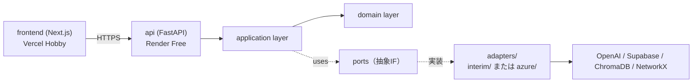

# 実装プラン（暫定環境版・体験スコープ）— Tech0 Search

作成日: 2026-05-06（v3: スコープを開発者 3 名の体験版に縮小）
対象: `03_PROJECT_ZERO_要件定義書_ver07.docx` / `04_PROJECT_ZERO_仕様設計書_ver03.docx`
位置づけ: 既存 `../IMPLEMENTATION_PLAN.md`（文書整備プラン）の補完。本書は **Streamlit MVP を Next.js + FastAPI + Supabase に移行する体験を 3 名の開発者で積むため**の方針書。

## v3 主要変更点（v2 比）

| 項目 | v2（300 名 PoC 版） | v3（3 名 体験版・本版） |
|---|---|---|
| 利用者数 | 約 300 名（DAU 250 名） | 開発者 3 名のみ |
| 目的 | Phase 1 PoC の動作確認・性能検証 | スタック未習熟解消の「触ってみる」体験 |
| コスト目標 | $76〜252／月 | **$0〜$5／月（OpenAI 試打分のみ許容）** |
| SLO・性能測定 | 仕様§14.1 と整合 | 今回スコープ外。Azure リリース時に再評価 |
| 監査ログ・楽観ロック | 厳格に実装 | 最小限。Azure リリース時に厳格化 |
| 負荷試験（k6） | Sprint 1 末で実施 | 不要 |
| シークレット管理 | Doppler 中央集中 | 各サービスの環境変数 UI ＋ GitHub Secrets のみ |
| キャッシュ層 | Upstash Redis 必須 | 不要（必要時に追加） |
| Render プラン | Standard（$25） | **Free（$0）** |

過去版は `archive/IMPLEMENTATION_PLAN_INTERIM_v1.md`（Phase 1 PoC 版）／`archive/IMPLEMENTATION_PLAN_INTERIM_v2.md`（MVP 反映版）として保存。スコープ拡張時は v2 を参照する。

---

## 0. ゴール

開発者 3 名が Next.js + FastAPI + Supabase + ChromaDB + NetworkX のスタックを通しで触り、Streamlit MVP と同等の動作（アイデア入力 → ベクトル検索 → グラフ補完 → LLM 評価 → GO/NO 判定）を Web 経由で確認できる状態に到達する。スプリント終了の判定基準は「3 名がそれぞれの開発機からローカル起動と暫定環境の両方で E2E を実行できた」とする。

| 観点 | 達成状態 |
|---|---|
| 体験スコープ | 3 名がローカル `docker compose up` で起動できる／暫定環境（Vercel + Render Free + Supabase Free）に push して動作確認できる |
| 移行体験 | Streamlit の挙動を Next.js + FastAPI で再現する。MVP の ChromaDB／NetworkX ロジックは Port-Adapter 越しに移植する |
| Azure 接続性 | アダプタを差し替えるだけで Azure に切替できる構造を実装段階で準備する（コードは書かない、IF 設計のみ） |
| 非スコープ | 性能要件・SLO 達成・監査ログ厳格性・認証・負荷試験は今回扱わない（Azure リリース時に再導入） |

参考章: 要件§1（プロジェクト概要）、要件§4（アーキテクチャ方針）、仕様§1（アーキテクチャ設計）、仕様§5（インフラ仕様）。

---

## 1. アーキテクチャ方針

### 1.1 採用パターン

| 方針 | 採用形態 | 根拠 |
|---|---|---|
| アプリ全体 | モジュラーモノリス | 仕様§1／要件§4.3 |
| 外部依存の抽象化 | ヘキサゴナル（Port-Adapter） | 要件§4.3「LLM プロバイダーの切替をアダプター交換のみで対応」 |
| API スタイル | REST / OpenAPI 3.0 | 仕様§3.1 |

### 1.2 レイヤー構造



Service 層と Domain 層は Port にのみ依存し、アダプタの実体を知らない。Azure 環境到達時はアダプタを差し替えるだけで本番化できる構造を維持する。

---

## 2. 暫定環境の選定（無料枠優先）

### 2.1 各層のサービス選定

#### 2.1.1 フロントエンド（Next.js）

| 候補 | プラン | 月額 | 備考 |
|---|---|---|---|
| Vercel Hobby | 無料 | $0 | 採用。Next.js 最適化・ブランチプレビュー・帯域 100GB |
| Cloudflare Pages | 無料 | $0 | 代替。Next.js SSR は Workers 経由で制約あり |

#### 2.1.2 バックエンド（FastAPI）

| 候補 | プラン | 月額 | 備考 |
|---|---|---|---|
| Render Free Web Service | 無料 | $0 | **採用**。750h／月・15 分非アクティブで停止・初回リクエスト 30 秒程度のコールドスタート・**永続ディスク不可** |
| Fly.io | Hobby | $0〜 | クレジットカード必須・無料 allowance あり。CC 登録の心理的負担を避けるため不採用 |
| Railway | Hobby | $5 クレジット | 無料枠が縮小傾向。CC 必須。不採用 |
| Koyeb | Free | $0 | 1 サービス・512MB・スリープあり。代替案 |

採用根拠: Render Free は CC 不要で立ち上がりが最も速い。コールドスタート 30 秒は 3 名の体験用途では許容範囲。**永続ディスクが使えないため、ChromaDB／NetworkX は起動毎に再構築する設計とする**（後述§3.2）。

#### 2.1.3 業務 DB（リレーショナル）

| 候補 | プラン | 月額 | 備考 |
|---|---|---|---|
| Supabase Free | 無料 | $0 | **採用**。500MB DB／1GB Storage／pgvector 拡張あり／7 日無アクセスで一時停止（再開は数秒）／CC 不要 |
| Neon Free | 無料 | $0 | 代替。3GB／ブランチ機能 |

採用根拠: Storage（後述§2.1.6）も含めて Supabase に集約することで、サービス数を減らし 3 名の運用負荷を最小化する。

#### 2.1.4 ベクトル検索

MVP の ChromaDB を踏襲する。Render Free に永続ディスクがないため、ChromaDB のデータを **Supabase Storage** に退避し、起動時にダウンロード → メモリ上で再構築する運用とする。

| 候補 | 月額 | 備考 |
|---|---|---|
| ChromaDB（インメモリ＋Supabase Storage 退避） | $0 | **採用**。MVP 踏襲・Render Free と整合 |
| Supabase pgvector | $0 | 代替。コールドスタート時の再構築が不要だが、MVP と異なる API になり書き換え工数発生 |
| Qdrant Cloud Free | $0 | 1 クラスタ無料・別サービス追加で運用負荷増 |

スイッチング判断: コールドスタート時の再構築時間が体感を損なうレベルになったら（数十秒以上）Supabase pgvector へ変更する。Port が同じため切替コストは 1 アダプタ分のみ。

#### 2.1.5 GraphRAG（関連性補完）

MVP の NetworkX を踏襲する。グラフのスナップショット（gpickle または JSON）を Supabase Storage に退避し、起動時にロード → メモリ上で運用する。

| 候補 | 月額 | 備考 |
|---|---|---|
| NetworkX（インメモリ＋Supabase Storage 退避） | $0 | **採用**。MVP 踏襲 |
| Microsoft GraphRAG | $0（OSS）＋実行コスト | Phase 2 以降検討。現行スコープ外 |

#### 2.1.6 全文検索（BM25）

今回スコープ外。意味検索（ChromaDB のベクトル類似度）のみで MVP の挙動を再現する。Azure 移行時に AI Search の BM25 が自動有効化される。

#### 2.1.7 キャッシュ（Redis）

今回不要。`CachePort` は定義するが、暫定アダプタは「メモリ内 dict」または「No-op」で実装する。Upstash Redis Free は将来必要になれば追加可能（10K cmd／日無料）。

#### 2.1.8 Blob ストレージ

| 候補 | 月額 | 備考 |
|---|---|---|
| Supabase Storage Free | $0 | **採用**。1GB 無料・DB と同居・PDF 添付と ChromaDB／NetworkX のスナップショットを置く |
| Cloudflare R2 Free | $0 | 代替。10GB 無料だが別サービス追加 |

#### 2.1.9 LLM

| 候補 | 月額 | 備考 |
|---|---|---|
| OpenAI gpt-4o-mini | $0〜数百円 | **採用（推奨）**。Azure OpenAI と API 互換・gpt-4o-mini は $0.15／1M 入力 ＋ $0.60／1M 出力。3 名 × 数百回試打で月数百円程度。CC 必須 |
| Google Gemini Free | $0 | 代替。完全無料（15 RPM 制限）。`gemini-1.5-flash` で gpt-4o-mini 相当の質。Azure 移行時にプロンプト微調整が必要 |
| Anthropic Claude API | $0〜 | 同上。Azure 移行時に書き換え工数発生 |

採用根拠: Azure OpenAI への移行を見据えると OpenAI API が API 互換性で最も近い。**完全無料に拘る場合は Gemini Free が代替**で、`LLMPort` 経由のため切替容易。OpenAI API キーは「誰のキーを使うか」を 3 名で事前合意する（個人キー or 組織キー）。

#### 2.1.10 OCR

| 候補 | 月額 | 備考 |
|---|---|---|
| Tesseract（OSS） | $0 | **採用**。コンテナ同梱・追加 API 不要 |

#### 2.1.11 認証

今回不要。社内限定 URL ＋ Render の Basic Auth（環境変数で 1 アカウント発行）で十分。`AuthPort` は `NoneAdapter`。

### 2.2 暫定環境スタック総括（無料枠条件付き）

| 層 | サービス | プラン | 月額 | 無料枠条件 |
|---|---|---|---|---|
| フロント配信 | Vercel | Hobby | $0 | 商用利用不可・帯域 100GB／月・3 名利用なら余裕 |
| API 配信 | Render | Free Web Service | $0 | 750h／月（1 サービス常時起動可）・15 分非アクティブで停止・永続ディスク不可・512MB RAM |
| 業務 DB | Supabase | Free | $0 | 500MB DB・7 日無アクセスで一時停止（再開は数秒）・2 プロジェクトまで |
| ベクトル検索 | ChromaDB（メモリ）＋Supabase Storage | - | $0 | 起動毎にロード／保存・MVP 踏襲 |
| GraphRAG | NetworkX（メモリ）＋Supabase Storage | - | $0 | 起動毎にロード／保存・MVP 踏襲 |
| Blob | Supabase Storage | Free | $0 | 1GB ストレージ・2GB／月帯域 |
| 全文検索 | スコープ外 | - | $0 | Azure 移行時に AI Search で自動有効化 |
| キャッシュ | スコープ外（必要時 Upstash Free 追加） | - | $0 | Upstash Free は 10K cmd／日 |
| LLM | OpenAI gpt-4o-mini | 従量 | $0〜$5 | 3 名 × 数百回試打想定。Gemini Free に切替なら $0 |
| OCR | Tesseract | OSS | $0 | コンテナ同梱 |
| 認証 | Render Basic Auth ＋ IP 制限 | - | $0 | 環境変数で 1 アカウント |
| シークレット管理 | GitHub Secrets ＋ 各サービス UI | - | $0 | Doppler 等は今回不採用 |

太字行は MVP コードを踏襲する箇所。**3 名利用ではすべての無料枠で十分余裕がある**（無料枠オーバー条件は §8 末尾の脚注参照）。

---

## 3. Port / Adapter 境界設計

### 3.1 Port 一覧

| Port 名 | 暫定 Adapter | Azure Adapter（将来） |
|---|---|---|
| `LLMPort` | `OpenAIAdapter`（または `GeminiAdapter`） | `AzureOpenAIAdapter` |
| `VectorSearchPort` | `ChromaDBAdapter`（インメモリ＋Storage 退避） | `AzureAISearchAdapter` |
| `GraphRAGPort` | `NetworkXAdapter`（インメモリ＋Storage 退避） | `MsGraphRAGAdapter` |
| `KnowledgeStorePort` | `SupabaseJsonbAdapter` | `CosmosDBAdapter` |
| `RelationalDBPort` | `SupabasePostgresAdapter`（SQLAlchemy） | `AzureMySQLAdapter` |
| `BlobPort` | `SupabaseStorageAdapter` | `AzureBlobAdapter` |
| `OCRPort` | `TesseractAdapter` | `DocumentIntelligenceAdapter` |
| `CachePort` | `InMemoryDictAdapter`（No-op 同等） | `AzureCacheRedisAdapter` |
| `AuthPort` | `NoneAdapter` | `EntraIDAdapter` |
| `ObservabilityPort` | `OtelStdoutAdapter`（標準出力に JSON ログ） | `OtelAzureMonitorAdapter` |

`CachePort` は今回 No-op 実装で十分だが、IF を切っておくことで将来 Upstash／Azure Cache 追加が容易になる。

### 3.2 永続化なし環境での運用パターン

Render Free は永続ディスクが使えないため、ChromaDB／NetworkX のデータは **起動時ロード → メモリ運用 → 終了時保存（任意）** のパターンで実装する。

```python
# src/adapters/interim/chromadb_search.py
import chromadb
from src.adapters.interim.supabase_storage import SupabaseStorageAdapter
from src.ports.vector_search import VectorSearchPort

class ChromaDBAdapter(VectorSearchPort):
    def __init__(self, storage: SupabaseStorageAdapter, snapshot_key: str = "chroma/latest.tar"):
        self._storage = storage
        self._snapshot_key = snapshot_key
        # 起動時：Supabase Storage からスナップショット取得 → /tmp に展開
        local_path = self._storage.download(snapshot_key, dest="/tmp/chroma")
        self._client = chromadb.PersistentClient(path=local_path)
        self._coll = self._client.get_or_create_collection("documents")

    def semantic_search(self, query: str, n: int = 5, filters=None):
        res = self._coll.query(query_texts=[query], n_results=n, where=filters or {})
        return self._to_hits(res)

    def snapshot(self):
        # 終了時／定期保存：/tmp の chroma を tar にして Supabase Storage に upload
        self._storage.upload_dir("/tmp/chroma", self._snapshot_key)
```

```python
# src/adapters/interim/networkx_graph.py
import networkx as nx
import io
from src.ports.graphrag import GraphRAGPort

class NetworkXAdapter(GraphRAGPort):
    def __init__(self, storage, snapshot_key: str = "graph/latest.gpickle"):
        self._storage = storage
        self._snapshot_key = snapshot_key
        # 起動時：Supabase Storage から gpickle を取得 → メモリにロード
        data = self._storage.download_bytes(snapshot_key)
        self._g = nx.read_gpickle(io.BytesIO(data)) if data else nx.Graph()

    def traverse(self, seed_ids, depth=2, filters=None):
        ...
```

コールドスタート時はこの初期化に数秒〜十数秒かかるが、3 名利用の体験用途では許容する。

### 3.3 Azure 移行時に書き換える範囲

`adapters/azure/` 配下を新規実装するだけで、Service／Domain 層は不変。ChromaDB → Azure AI Search、NetworkX → Microsoft GraphRAG ＋ Cosmos DB Gremlin の差分吸収は v2 §3.3 を参照（本版では詳述しない）。

---

## 4. リポジトリ構造

monorepo を採用し、フロント・バック・共有型を 1 リポジトリで管理する。

```
project-zero/
├── apps/
│   ├── frontend/                  # Next.js + Tailwind (Vercel)
│   │   ├── src/app/               # /、/history
│   │   ├── src/components/
│   │   └── package.json
│   └── backend/                   # FastAPI (Render)
│       ├── src/
│       │   ├── api/               # /api/v1/* ルータ
│       │   ├── application/       # ユースケース層
│       │   ├── domain/            # エンティティ
│       │   ├── ports/             # 抽象 IF
│       │   ├── adapters/
│       │   │   ├── interim/       # OpenAI / ChromaDB / NetworkX / Supabase 等
│       │   │   └── azure/         # 将来用（IF 雛形のみ）
│       │   ├── infra/             # DI コンテナ・設定
│       │   └── main.py
│       ├── alembic/               # スキーマ移行
│       ├── tests/
│       ├── pyproject.toml
│       └── Dockerfile
├── packages/
│   └── shared-types/              # OpenAPI 3.0 YAML
├── infra/
│   └── docker-compose.yml         # ローカル: Postgres + FastAPI + Next.js
├── .github/workflows/
│   └── ci.yml                     # lint + test
├── .env.example
└── README.md
```

---

## 5. デプロイワークフロー（簡素版）

### 5.1 ブランチ戦略

| ブランチ | 動作 |
|---|---|
| `main` | Vercel Production／Render 自動デプロイ |
| `feature/*` | Vercel Preview 自動 |

### 5.2 シークレット管理

Doppler 等の有償ツールは使わない。

| 場所 | 内容 |
|---|---|
| GitHub Secrets | CI 用（テスト時に必要な API キー等） |
| Vercel 環境変数 UI | フロント実行時の `NEXT_PUBLIC_API_URL` |
| Render 環境変数 UI | バック実行時の `OPENAI_API_KEY`／`SUPABASE_URL`／`SUPABASE_KEY`／`BASIC_AUTH_USER`／`BASIC_AUTH_PASS` |
| Supabase ダッシュボード | DB スキーマ操作・Storage バケット管理 |

3 名の開発者間で「誰がどのキーを発行・更新するか」を README に明記する。

### 5.3 CI

GitHub Actions の単一ワークフロー `ci.yml` で lint と test のみ実行。デプロイは Vercel／Render の GitHub 連携機能に委ねる（Actions からの push は不要）。

---

## 6. 暫定 → Azure 移行（参考、本版ではスコープ外）

詳細は v2 §6 を参照。Azure リリース時に再導入する観点だけ列挙する。

| 項目 | 移行内容 |
|---|---|
| LLM | OpenAI → Azure OpenAI（base_url 差替） |
| ベクトル検索 | ChromaDB → Azure AI Search（インデックス再投入） |
| GraphRAG | NetworkX → Microsoft GraphRAG ＋ Cosmos DB Gremlin |
| 業務 DB | Supabase Postgres → Azure DB for MySQL（DDL 再生成・データ移行） |
| Blob | Supabase Storage → Azure Blob Storage |
| 認証 | None → Entra ID Bearer Token |
| 監査ログ厳格化・楽観ロック | このタイミングで導入（仕様§6.2／§13.9） |
| 性能要件・負荷試験 | このタイミングで導入（仕様§14） |

---

## 7. 受入基準（体験スコープ版）

### 7.1 動作確認の判定基準

| # | 項目 | 達成条件 |
|---|---|---|
| 1 | ローカル起動 | 3 名がそれぞれ `git clone` ＋ `docker compose up` で FastAPI ＋ Next.js を起動できる |
| 2 | 暫定環境疎通 | Vercel フロントから Render API 経由で Supabase に書き込める／ChromaDB から検索できる |
| 3 | E2E 1 ユースケース | アイデア入力 → ベクトル検索 → グラフ補完 → LLM 評価 → GO/NO 判定 → 結果画面表示が一気通貫で動く |
| 4 | Streamlit 並走 | 同じ入力で Streamlit MVP と同等の出力が得られる（Citation・スコアの存在確認レベル） |
| 5 | コールドスタート許容 | 初回 30 秒待機の後、2 回目以降は通常応答（数秒）になることを 3 名全員が確認 |

### 7.2 スコープ外（明示）

| 項目 | 扱い |
|---|---|
| 性能要件マトリクス（仕様§14） | 今回測定しない。Azure リリース時に再評価（v2 §7.1 を参考に再導入） |
| ハルシネーション率測定 | 今回測定しない。動作の正常終了のみ確認 |
| 負荷試験（k6 等） | 不要 |
| SLO バーンレートアラート | 不要 |
| データマイグレーションの expand-migrate-contract | 不要。Alembic の単純な `upgrade` のみ |
| Blue-Green デプロイ・カナリアリリース | 不要 |
| 監査ログの追記専用化・改ざん検知 | 簡易ログのみ |

---

## 8. コスト見積

### 8.1 月額試算

| サービス | プラン | 月額 |
|---|---|---|
| Vercel | Hobby | $0 |
| Render | Free Web Service | $0 |
| Supabase | Free | $0 |
| Supabase Storage | Free（1GB） | $0 |
| OpenAI gpt-4o-mini | 従量 | $0〜$5（3 名 × 数百回試打想定） |
| GitHub Actions | Public／Private 2,000 分 | $0 |
| **合計** | | **$0〜$5／月** |

OpenAI を Gemini Free に置き換えれば完全に **$0／月** で運用可能。

### 8.2 無料枠オーバー発生条件（参考）

| サービス | オーバー発生条件 | 3 名利用での余裕度 |
|---|---|---|
| Vercel Hobby | 帯域 100GB／月超 | 大幅に余裕（実質 1GB／月以下） |
| Render Free | 単一サービス常時起動なら 750h／月で収まる | 余裕（複数サービス起動時のみ注意） |
| Supabase Free DB | 500MB 超 | 余裕（数千レコード規模では届かない） |
| Supabase Storage | 1GB 超／2GB 帯域 超 | 余裕（ChromaDB／NetworkX スナップショットは数 MB〜数十 MB） |
| OpenAI gpt-4o-mini | 月額予算超過 | アカウント設定で月額上限を $5 に設定して防御 |

---

## 9. リスク・前提

| リスク | 対処 |
|---|---|
| Render Free のコールドスタート（15 分非アクティブで停止、初回 30 秒程度の遅延） | 体験用途では許容。デモ前に 1 度ウォームアップリクエストを叩く運用ルール |
| ChromaDB／NetworkX の起動時再構築コスト | 数十秒以内に収まる規模で運用（数千件・数千ノードまで）。データ量増加時は Supabase pgvector へ切替検討 |
| OpenAI API キーの個人負担 | 3 名で「誰のキーを使うか」を事前合意。月額上限を $5 に設定。または Gemini Free に切替 |
| Supabase Free の 7 日無アクセス停止 | 週 1 回はアクセスする運用。停止しても再開は数秒で復旧 |
| 認証なしの暴露リスク | Render Basic Auth ＋ 社内限定 URL で最低限の遮断。実機密データは投入しない |
| 体験中に Azure 環境が先に整った場合 | 本版の Port-Adapter 設計のままアダプタ実装を `azure/` に追加するだけで切替可能（v2 §6） |

### 9.1 前提

| 項目 | 前提 |
|---|---|
| データ | ダミーデータ・公開情報のみ。機密データは投入しない |
| 利用者 | 開発者 3 名のみ |
| 期間 | 1 スプリント（1 週間）で達成 |
| 完了後の扱い | Azure 環境到達まで暫定環境を維持。スコープ拡張時は v2 を参照して厳格化 |

---

## 10. 次のアクション（1 週間スプリント版）

| 優先度 | タスク | 着手目安 | 完了の定義 |
|---|---|---|---|
| **P0** | リポジトリ雛形作成＋docker-compose（ローカル動作） | Day 1 | 3 名が `git clone` ＋ `docker compose up` で FastAPI（`/health` 200）と Next.js（トップ画面）と Postgres コンテナを起動できる |
| **P0** | MVP コードを FastAPI ＋ ChromaDB ＋ NetworkX のモジュラー構造に再配置（Port-Adapter 越しに移植） | Day 2〜3 | `apps/backend/src/` に Port／Adapter／Service が並び、ローカルで 1 ユースケース（アイデア入力 → GO/NO 判定）が成功する |
| **P0** | Supabase に最小スキーマ作成＋MVP の JSON データ移行 | Day 3〜4 | Supabase ダッシュボードに `analyses`／`pages`（最小 2 テーブル）が存在し、JSON データが投入されている |
| **P1** | Vercel／Render Free へ初回デプロイ＋疎通確認 | Day 4〜5 | Vercel の URL からアイデア入力 → Render API → Supabase への一連が動く（コールドスタート 30 秒は許容） |
| **P1** | 3 名がそれぞれの開発機からローカル ＋ 暫定環境で 1 ユースケース通しで実行 | Day 5〜7 | 3 名全員が動作確認の完了報告を済ませる |

スプリント終了の判定基準: **3 名がそれぞれの開発機からローカル起動と暫定環境の両方で「アイデア入力 → ベクトル検索 → グラフ補完 → LLM 評価 → GO/NO 判定」を E2E で実行できた**。動作品質（性能・整合性）は問わない。

---

## 参考資料

| 文書 | バージョン | 主な参照 |
|---|---|---|
| 要件定義書 | ver07 | §1／§4／§7（全体方針）。性能要件§6・§NFR は本版スコープ外 |
| 仕様設計書 | ver03 | §1／§3／§5（実装方針）。§10〜§15 は本版スコープ外（Azure リリース時に再導入） |
| 過去版 | v1（300 名 PoC）／v2（MVP 反映） | スコープ拡張時は `archive/IMPLEMENTATION_PLAN_INTERIM_v2.md` を参照 |
