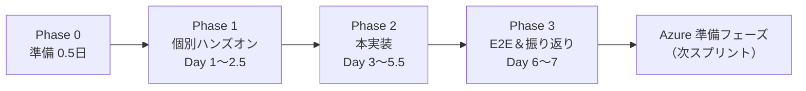

# 学習＆実装アクションプラン — Tech0 Search 暫定環境スプリント

作成日: 2026-05-06
対象: 開発者 3 名（Next.js／FastAPI／Supabase／Vercel／Render／ChromaDB／NetworkX に未習熟または経験浅め）
位置づけ: `IMPLEMENTATION_PLAN_INTERIM.md`（v3）が「何を作るか」の決定文書。本書は「3 名がどう動くか」「Claude とどう協業するか」を定義する実行プラン。
学習スタンス: **動かしながら理解する**。詰まったら 2 時間以内に Claude に聞く。完璧を狙わず、まず E2E で 1 本通す。

---

## 1. 全体の流れ



期間: 1〜1.5 週間（学習込み）。総工数の目安は 22〜23 人日（3 名 × 7〜8 日 ≒ 21〜24）。

---

## 2. Claude との協業モデル

### 2.1 3 つのモード

| モード | 使う場面 | 進め方 | 推奨頻度 |
|---|---|---|---|
| **ペアモード** | 新規ファイル作成・初見ライブラリ・雛形が欲しい時 | Claude に方針相談 → 雛形生成 → 自分で書き直す | 1 日 1〜2 回 |
| **ソロモード** | 自分で書いた後にレビューが欲しい時 | 自分で実装 → 差分を Claude に貼ってレビュー依頼 | 1 日 2〜3 回 |
| **質問モード** | 概念理解・エラー原因・選択肢比較 | 状況を 5 行以内で説明し、選択肢ごと長所短所を聞く | 詰まる度（2 時間ハマったら必ず） |

### 2.2 プロンプト例

ペアモード:
- 「FastAPI で `/api/v1/analyses` の POST エンドポイントを作りたい。Pydantic で `market`／`asset`／`idea_detail` の 3 フィールドをバリデーションし、Idempotency-Key ヘッダー必須にする雛形を提示」
- 「ChromaDB のコレクションを Supabase Storage から起動時にロードするアダプタクラスの最小実装を提示。Port は `VectorSearchPort.semantic_search(query, n)`」
- 「Next.js App Router で `/` にアイデア入力フォーム（textarea×3＋送信）を作りたい。Tailwind で最低限スタイル。送信は `fetch('/api/v1/analyses', ...)`」

ソロモード:
- 「以下の FastAPI ルータを書いた。レビュー観点: 例外処理・型注釈・依存性注入の使い方が適切か。改善提案を箇条書きで」
- 「以下の SQLAlchemy モデルで `analyses` を定義した。Supabase（Postgres）と Azure DB for MySQL の両方で動くか確認したい」

質問モード:
- 「Render Free でコールドスタートが 30 秒かかる理由と、ウォームアップを最小コストでやる方法を 3 つ」
- 「Pydantic v1 と v2 の Breaking Change で気をつける点を、本プロジェクトのスコープに絞って 5 つ」

### 2.3 線引き：自分で考える／Claude に任せる

| 自分で考えるべき | Claude に任せていい |
|---|---|
| ユースケースの仕様判断（GO/NO の閾値・UI 文言） | ボイラープレート（FastAPI 雛形・Tailwind の class 並び） |
| ドメインモデルの命名・責務分割 | 既知ライブラリの定型パターン（SQLAlchemy セッション・Alembic 設定） |
| 「なぜ自分は詰まっているか」の言語化 | エラーメッセージから原因候補を 3 つ挙げてもらう |
| 学んだことのメモ化（自分の言葉で） | 専門用語の初学者向け 1 行解説 |

### 2.4 PR レビュー依頼テンプレ

```
【概要】何を変えたか（1〜2 行）
【意図】なぜこの変更が必要か（背景）
【レビューしてほしい観点】
- 観点A（例：Port 依存の方向が正しいか）
- 観点B（例：例外処理の漏れ）
【セルフチェック】
- [ ] 既存テストが通る
- [ ] 新規テスト追加（必要なら）
- [ ] ローカルで E2E が動く
```

### 2.5 デバッグ依頼テンプレ（最小再現コード）

```
【症状】期待動作と実際の差を 1 行で
【再現手順】1〜3 ステップ
【最小再現コード】10〜30 行に削ったもの
【エラーメッセージ全文】スタックトレースをそのまま貼る
【試したこと】2〜3 個
```

### 2.6 学習効果を上げるコツ

| コツ | 内容 |
|---|---|
| 写経ルール | Claude に貰った雛形のうち 1 ファイルは必ず手で打ち直す。タイポと違和感に気づく |
| 用語集を自分で更新 | `docs/glossary.md` に 1 日 3 語追加（後述§7） |
| 毎日の振り返り | 終業前 5 分で「今日の勝因／敗因／明日やること」を `learning-notes/YYYY-MM-DD.md` に書く |
| ペアプロ | 1 日 1 回は別メンバーと画面共有しながらコードを書く |

---

## 3. Phase 0：準備（半日）

### 3.1 サインアップチェックリスト

| サービス | 用途 | URL | 注意 |
|---|---|---|---|
| GitHub | リポジトリ・CI | github.com | チームメンバー全員にコラボ権限付与 |
| Vercel | フロント配信 | vercel.com | GitHub アカウントで連携 |
| Render | API 配信 | render.com | Free Web Service 選択／CC 不要 |
| Supabase | DB＋Storage | supabase.com | プロジェクト 1 個（3 名共有）／無料 |
| OpenAI | LLM | platform.openai.com | 月額上限を $5 に設定／キー所有者は事前合意 |

### 3.2 ローカル開発環境

| 項目 | バージョン／推奨 |
|---|---|
| Node.js | 20 LTS |
| Python | 3.12 |
| Docker Desktop | 最新版 |
| エディタ | VS Code ＋ 拡張: ESLint、Prettier、Tailwind CSS IntelliSense、Python、Pylance、Docker、GitLens |
| Git | 設定: `git config --global pull.rebase false`（チーム規約） |

### 3.3 Git／GitHub の最低スキル確認

| スキル | 確認方法 |
|---|---|
| ブランチ作成・切替 | `git checkout -b feature/xxx`／`git branch` |
| commit／push | `git commit -m "..."`／`git push origin feature/xxx` |
| PR 作成・レビュー | GitHub UI から PR を作成／別メンバーにレビュー依頼 |
| コンフリクト解消 | 簡単な競合を VS Code で解消できる |

不安があれば §6 のトラブルシュートに進む前に Claude に聞く。

### 3.4 キックオフ MTG（30 分）

3 名で以下をすり合わせる:
1. プロンプト書き方の共通ルール（§2.2 をベースに）
2. 「2 時間ハマったら聞く」の宣言
3. 当番制（OpenAI キー管理者・Supabase 管理者・Render 管理者を 1 名ずつ）

---

## 4. Phase 1：個別ハンズオン（Day 1〜2.5）

各課題は 30〜60 分で完了する粒度。**2 時間以上ハマったら必ず Claude に聞く**。

| # | 技術 | 目的 | 所要 | 最小ハンズオン課題 | 完了確認 | Claude サポート例 |
|---|---|---|---|---|---|---|
| H1 | Docker Compose | サービスを束ねて起動できるようになる | 45 分 | `docker-compose.yml` で Postgres ＋ pgAdmin を起動。pgAdmin から Postgres に接続 | `docker compose up` で 2 サービスが起動 | compose ファイルの最小例を提示 |
| H2 | FastAPI | エンドポイントを書ける | 45 分 | `/hello`（GET）と `/echo`（POST、Pydantic で `{message: str}`）を実装 | `curl` で 200 応答／不正入力で 422 | Pydantic v2 のフィールドバリデーション例 |
| H3 | Pydantic | 入力バリデーションを書ける | 30 分 | H2 のモデルに `min_length=1`／`max_length=500`／カスタム validator を追加 | テストで境界値が弾かれる | バリデーション失敗時のエラー形式（RFC 7807） |
| H4 | SQLAlchemy + Supabase | DB に CRUD できる | 60 分 | Supabase に `pages(id, title, body, created_at)` を作成し、SQLAlchemy で 1 行 INSERT／SELECT | Supabase ダッシュボードでレコード確認 | `engine = create_engine(DATABASE_URL)` の最小例と Alembic 初期化 |
| H5 | ChromaDB | ベクトル検索を体験する | 45 分 | 5 件のテキストを add → semantic search で類似 3 件を取得 | スコアと文書 ID が表示される | 永続化と一時インスタンスの違いを 5 行で説明 |
| H6 | NetworkX | グラフ走査を体験する | 45 分 | 10 ノードのグラフを作り、BFS で深さ 2 の近傍を取得 | 隣接ノードリストが返る | gpickle 保存／ロードの落とし穴 |
| H7 | Next.js App Router | ページとフォームを書ける | 60 分 | `/` にアイデア入力フォーム（textarea × 3＋送信ボタン）を作り、コンソールに入力値を表示 | 送信時に画面遷移なくログ出力 | `'use client'` ディレクティブの判断基準 |
| H8 | Tailwind CSS | 最低限の見た目を作れる | 30 分 | H7 のフォームに padding／余白／ボタン色を Tailwind で当てる | 画面が読みやすく整う | クラスが効かない時のチェックリスト |
| H9 | 環境変数と Secrets | 安全にキーを扱える | 30 分 | `.env.local` を作成し、Next.js から `NEXT_PUBLIC_API_URL` を読む。Vercel UI でも同名を設定 | ビルドが通り画面に値が表示 | クライアント露出 vs サーバー専用の見分け方 |

完了の判定: 9 課題すべて 3 名が完了する。詰まりが多ければ Claude とのペアモードで巻き返す。

---

## 5. Phase 2：本実装（Day 3〜5.5）

`IMPLEMENTATION_PLAN_INTERIM.md` v3 §10 の TOP5 を学習目線で再分解する。

### 5.1 タスク分解

| # | タスク | 推奨モード | 学習ポイント | Claude が用意する雛形 | 振り返り 3 項目 |
|---|---|---|---|---|---|
| T1 | リポジトリ雛形＋docker-compose | ペア | monorepo 構造／Port 抽象化の最初の一歩 | ディレクトリ階層・`pyproject.toml`・`package.json`・`docker-compose.yml`・`.env.example` | (1) なぜ monorepo か (2) Port を切る理由 (3) compose で同居する理由 |
| T2 | MVP コードを Port-Adapter 越しに移植 | ペア → ソロ | ヘキサゴナル理解／DI／ChromaDB クライアントの使い方 | `LLMPort`／`VectorSearchPort`／`GraphRAGPort` の抽象基底クラス・暫定アダプタ雛形（OpenAI／ChromaDB／NetworkX）・DI コンテナ | (1) Port を切ると何が嬉しいか (2) MVP からの差分 (3) Azure 移行時に変わる箇所 |
| T3 | Supabase スキーマ＋JSON データ移行 | ペア | SQLAlchemy モデル／Alembic マイグレーション／データシード | SQLAlchemy モデル（`analyses`／`pages`）・Alembic init 設定・JSON → Postgres 移行スクリプト | (1) `alembic upgrade head` の意味 (2) 主キーの扱い (3) 移行漏れの検知方法 |
| T4 | Vercel／Render Free へデプロイ | ソロ | 環境変数管理／CI/CD 最小／ログの読み方 | `render.yaml`／`vercel.json`／GitHub Actions `ci.yml`・Basic Auth ミドルウェア | (1) Render ログから何が読めるか (2) Vercel Preview と Production の差 (3) 環境変数の流れ |
| T5 | 3 名 E2E 実行 | ソロ × 3 | 実機での挙動差／コールドスタート観察 | E2E 手順書・チェックリスト雛形 | (1) 自分の環境で詰まった点 (2) 他 2 名との差 (3) Azure 移行時に解消したい不便 |

### 5.2 Claude が事前に提供する雛形コード一覧

| ファイル | 内容 |
|---|---|
| `apps/backend/src/ports/llm.py` | `LLMPort` 抽象基底クラス |
| `apps/backend/src/ports/vector_search.py` | `VectorSearchPort`＋`SearchHit` データクラス |
| `apps/backend/src/ports/graphrag.py` | `GraphRAGPort`＋`GraphHit` |
| `apps/backend/src/adapters/interim/openai_llm.py` | OpenAI チャット呼び出しの最小実装 |
| `apps/backend/src/adapters/interim/chromadb_search.py` | ChromaDB ＋ Supabase Storage 退避 |
| `apps/backend/src/adapters/interim/networkx_graph.py` | gpickle ロード／BFS 走査 |
| `apps/backend/src/infra/container.py` | DI コンテナ（プロファイル切替） |
| `apps/backend/src/api/analyses.py` | POST `/api/v1/analyses` ルータ |
| `apps/backend/alembic/env.py` | Alembic 初期設定 |
| `apps/backend/scripts/migrate_json_to_supabase.py` | JSON → Postgres 投入スクリプト（冪等） |
| `apps/frontend/src/app/page.tsx` | アイデア入力フォーム＋結果表示 |
| `apps/frontend/src/lib/api.ts` | fetch ラッパー＋型 |
| `infra/docker-compose.yml` | Postgres ＋ FastAPI ＋ Next.js ＋ Tesseract |
| `.github/workflows/ci.yml` | lint ＋ test の最小ワークフロー |
| `render.yaml` | Render Blueprint（Free Web Service 設定） |
| `README.md` | 起動手順・キー所有者・運用ルール |

3 名は **写経ルール（§2.6）** に従い、最低 1 ファイルは雛形をそのままコピーせず手で打ち直す。

---

## 6. Phase 3：E2E 動作確認＆振り返り（Day 6〜7）

### 6.1 各人が実行するチェックリスト

| # | 確認項目 |
|---|---|
| 1 | ローカル `docker compose up` で 3 サービスが起動する |
| 2 | `/api/v1/analyses` に POST でアイデアを投げると 200 OK で結果が返る |
| 3 | Vercel の自分の Preview URL から本物の API（Render Free）と通信できる |
| 4 | Render が 15 分非アクティブ後、初回リクエストでコールドスタートする時間を計測（ストップウォッチ） |
| 5 | OpenAI のトークン消費を 1 回分メモ（`usage` フィールドから） |
| 6 | 結果画面に GO／NO ラベルと Citation 風の出力が表示される |
| 7 | Streamlit MVP と同じ入力で出力差分を観察 |

### 6.2 観察ポイント

| ポイント | 記録すべきこと |
|---|---|
| コールドスタート時間 | 初回／2 回目／5 回目の応答時間 |
| トークン消費 | 1 リクエストあたり入力／出力トークン数 |
| レスポンス内容の妥当性 | GO／NO の根拠が文章で示されているか |

### 6.3 スプリント終了報告テンプレ

```
【完了タスク】T1〜T5 のうち何が完了したか
【未完了タスク】残課題と理由
【動作確認結果】上記§6.1 の 7 項目
【観察結果】コールドスタート○秒／1リクエスト○トークン
【次スプリントへ持ち越す学び】3 点
```

### 6.4 振り返り（YWT）

3 名で 30 分:
- **Y（やったこと）**: 各人 3 件
- **W（わかったこと）**: 各人 2 件（技術／プロセス）
- **T（つぎやること）**: チーム共通 3 件（Azure 準備に持ち越し）

---

## 7. 詰まったときのガイド

### 7.1 典型的なつまずきと対処

| 症状 | 原因の典型 | 対処 |
|---|---|---|
| フロントから API を叩くと CORS エラー | FastAPI の `CORSMiddleware` 未設定 | `allow_origins=[VERCEL_URL, "http://localhost:3000"]` を追加 |
| Pydantic で `BaseModel` のメソッドが動かない | v1 と v2 の Breaking（`dict()` → `model_dump()` 等） | v2 に統一。Claude に「Pydantic v2 の同等メソッド」を質問 |
| Render に push 後 502／応答が遅い | コールドスタート（15 分非アクティブ後 30 秒） | 1 度ウォームアップ。本格運用は Starter プランへ |
| Supabase 接続文字列で `password` 部分にエラー | URL エンコード忘れ（`@` 等） | `quote_plus` で URL エンコード |
| ChromaDB の検索結果が毎回違う | 永続化していない／コレクションを毎回作り直し | `PersistentClient` を使い、`get_or_create_collection` で再利用 |
| NetworkX の `read_gpickle` でエラー | NetworkX 3.x で削除された／pickle 互換性 | `pickle.load` を直接使うか、JSONL に変えて移行 |
| Next.js で環境変数が `undefined` | `NEXT_PUBLIC_` 接頭辞が無い／ビルド後 | クライアント露出は `NEXT_PUBLIC_*`、サーバー専用は接頭辞なし |

### 7.2 良いプロンプトと悪いプロンプト

| 悪い例 | 良い例 |
|---|---|
| 「動かないから直して」 | 「FastAPI で `/api/v1/analyses` POST を叩くと 500。エラーは `psycopg2.OperationalError`、ローカル docker compose の Postgres には接続できる。Render では失敗。原因候補 3 つと確認方法を教えて」 |
| 「ChromaDB のサンプル」 | 「ChromaDB で 100 件の文書を `add` して `query` で類似 5 件を取得する最小コード。永続化は `PersistentClient`。本プロジェクトの `VectorSearchPort.semantic_search(query, n)` に合わせた形で」 |
| 「Render の使い方」 | 「Render Free で FastAPI を Docker デプロイ。`render.yaml` の最小構成と、コールドスタート時の挙動と、ログをローカルから tail する方法を 3 段で」 |

### 7.3 公式ドキュメント最短リンク集

| 技術 | URL |
|---|---|
| Next.js App Router | nextjs.org/docs/app |
| Tailwind CSS | tailwindcss.com/docs |
| FastAPI | fastapi.tiangolo.com |
| Pydantic v2 | docs.pydantic.dev |
| SQLAlchemy 2.0 | docs.sqlalchemy.org |
| Alembic | alembic.sqlalchemy.org |
| Supabase | supabase.com/docs |
| ChromaDB | docs.trychroma.com |
| NetworkX | networkx.org/documentation/stable |
| Render | render.com/docs |
| Vercel | vercel.com/docs |
| OpenAI API | platform.openai.com/docs |

---

## 8. 学んだことの記録方法

### 8.1 ディレクトリ構造

```
docs/
├── learning-notes/
│   ├── 2026-05-06-alice.md
│   ├── 2026-05-06-bob.md
│   └── 2026-05-06-carol.md
└── glossary.md
```

### 8.2 ルール

| 対象 | ルール |
|---|---|
| 日次メモ | 各人が 1 日 1 ファイル。終業前 5 分で「Y／W／T」3 行ずつ |
| 用語集 | 1 人 1 日 3 単語追加。重複は OK（ニュアンスが違うため） |
| スプリント末 | 3 名で 30 分集まり、用語集を統合・整理。チームの教科書として残す |

### 8.3 用語集のフォーマット

```markdown
## ヘキサゴナル
ビジネスロジック（Domain）を中心に置き、外部依存（DB／API／UI）を Port-Adapter で外側に追い出す設計。差し替え可能性が高まる。本プロジェクトでは Azure 移行時のコード変更を最小化する目的で採用。

## ChromaDB
Python ネイティブの埋め込みベクトル検索ライブラリ。OSS。本プロジェクトでは MVP の踏襲として暫定環境に採用。永続化はファイル／インメモリ／クライアント API の 3 形式。
```

---

## 9. スコープ外と次フェーズへの繋ぎ

### 9.1 今回扱わない

- 性能要件マトリクス（仕様§14）／SLO バーンレートアラート（仕様§11.5）
- 監査ログの追記専用化／改ざん検知（仕様§13.9）
- 楽観ロック（仕様§6.2）
- 認証（Entra ID／RBAC、仕様§13.5）
- キャッシュ（Redis、仕様§8）
- 負荷試験（k6、仕様§14.3）／カオステスト
- データマイグレーションの expand-migrate-contract（仕様§12.3）
- Blue-Green デプロイ／カナリアリリース（仕様§12.6）

### 9.2 次フェーズ（Azure 準備フェーズ）への繋ぎ

本スプリントで `apps/backend/src/adapters/azure/` の **IF 雛形のみ** が並ぶ状態をゴールとする。Azure リリースフェーズでは、本書の `archive/IMPLEMENTATION_PLAN_INTERIM_v2.md` を参照しつつ、以下を順に追加する: ①Azure リソース構築、②`azure/` 配下のアダプタ実装、③データ移行（Postgres → MySQL／ChromaDB → AI Search／NetworkX → MS GraphRAG）、④認証・監査・性能・負荷試験の厳格化。本スプリントで貯まった学び（用語集・コールドスタート観察・トークン消費メモ）が次フェーズの初動を加速する。

---

## 参考資料

| 文書 | 役割 |
|---|---|
| `IMPLEMENTATION_PLAN_INTERIM.md`（v3） | 本スプリントの「何を作るか」決定文書 |
| `archive/IMPLEMENTATION_PLAN_INTERIM_v2.md` | スコープ拡張時の参照（Phase 1 PoC 規模） |
| `03_PROJECT_ZERO_要件定義書_ver07_要約付き_整形.docx` | 要件の上位仕様 |
| `04_PROJECT_ZERO_仕様設計書_ver03_PM向け補足付き_整形.docx` | 実装の詳細仕様 |
