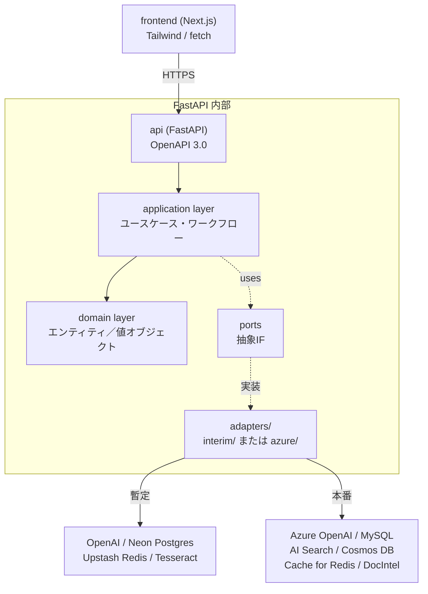
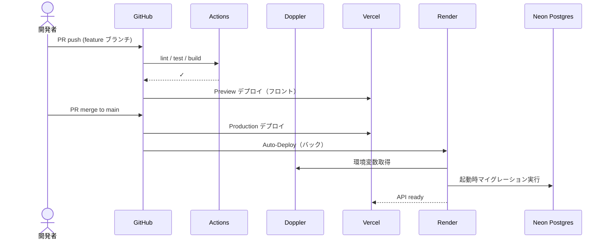
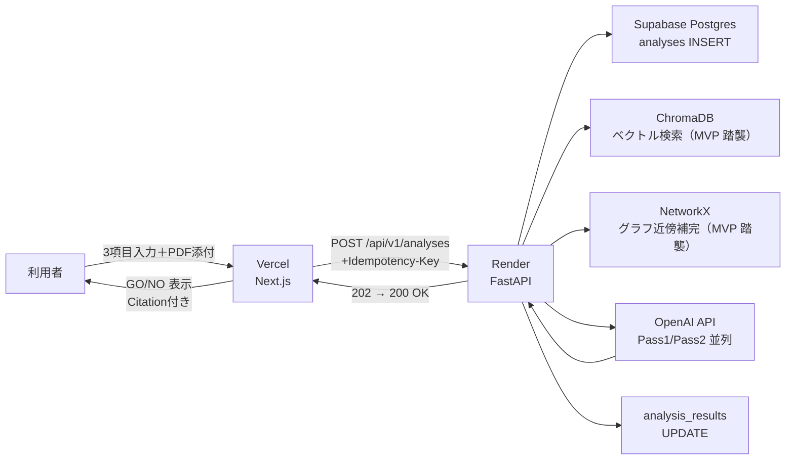

# 実装プラン（暫定環境版）— Tech0 Search

作成日: 2026-05-06（v2: MVP 実装状況を反映）
対象: `03_PROJECT_ZERO_要件定義書_ver07.docx` / `04_PROJECT_ZERO_仕様設計書_ver03.docx`
位置づけ: 既存 `IMPLEMENTATION_PLAN.md`（文書整備プラン）の補完。本書は実装作業の方針書。
方針: Azure 環境がまだ使えない期間でも Phase 1 PoC 相当の動作確認まで到達する暫定構成と、Azure 到達時の最小コード変更で本番化できる設計を両立する。
v1 → v2 主要変更: MVP で稼働中のスタック（ChromaDB／NetworkX／JSON ファイル）を踏襲する形に方針を修正。リレーショナル DB は Supabase へ移行を推奨（§2.1.3）。前バージョンは `IMPLEMENTATION_PLAN_INTERIM_v1.md` として保存。

---

## 0. 前提と本書のゴール

| 項目 | 内容 |
|---|---|
| 確定済み技術スタック | フロント Next.js（TypeScript）＋Tailwind CSS、API FastAPI（Python）（仕様§1.3／要件§4.2） |
| 本番のターゲット構成 | Azure テナント内に閉じる（要件§7.4）。検索 Azure AI Search、ナレッジ Cosmos DB、推論 Microsoft GraphRAG、LLM Azure OpenAI、業務 DB Azure Database for MySQL、キャッシュ Azure Cache for Redis、OCR AI Document Intelligence |
| 暫定運用が必要な理由 | Azure サブスクリプション・閉域接続・Entra ID 連携の手配が完了するまで、開発と PoC 動作確認を止めない |
| 達成基準 | アイデア入力 → ハイブリッド検索 → GraphRAG 関連性補完 → 3 軸 LLM 評価 → GO/NO 判定 → 結果画面表示の一気通貫フローを暫定環境で再現する |
| 移行コストの目標 | Azure 到達時のコード変更を「設定値とアダプタ実装の差し替え」に限定。ドメイン層・ユースケース層・API 仕様は不変 |

参考章: 要件§1（プロジェクト概要）、要件§4（アーキテクチャ方針）、要件§7（制約条件）、仕様§1（アーキテクチャ設計）、仕様§5（インフラ仕様）、仕様§15（サーバーレス適用）。

---

## 1. アーキテクチャ方針

### 1.1 採用パターン

| 方針 | 採用形態 | 根拠 |
|---|---|---|
| アプリ全体 | モジュラーモノリス（Phase 1）→ マイクロサービス分解（Phase 2 以降） | 仕様§1／要件§4.3 |
| 外部依存の抽象化 | ヘキサゴナル（Port-Adapter） | 要件§4.3「LLM プロバイダーの切替をアダプター交換のみで対応」、§4.4「依存性逆転の原則」 |
| API スタイル | REST / OpenAPI 3.0 / RFC 7807 | 仕様§3.1／要件§4.4.1 |
| 並行性 | FastAPI の async + ThreadPoolExecutor | 要件§4.3／FR-004／FR-005 |
| バージョニング | URL パス（/api/v1/） | 仕様§3.1 |

### 1.2 レイヤー構造



### 1.3 Port-Adapter の二系統運用

「暫定実装」と「Azure 実装」を 2 つのアダプタファミリーとして同居させ、環境変数で切替する。Service 層と Domain 層は Port にのみ依存し、アダプタ実装を知らない。Azure 環境到達時はアダプタ差し替えと環境変数更新のみで切替が完了する設計とする。

切替単位は環境変数 `ADAPTER_PROFILE=interim|azure` の 1 値とし、DI コンテナ（後述§4.3）が起動時に対応するアダプタファミリーを束ねて Service 層へ注入する。

---

## 2. 暫定デプロイ環境の選定

### 2.1 各層のサービス比較と推奨

#### 2.1.1 フロントエンド（Next.js）

| 候補 | 推奨度 | 強み | 弱み |
|---|---|---|---|
| Vercel | ◎（採用） | Next.js 公式の最適化・ブランチプレビュー・Edge Network・無料枠で十分 | 商用利用は Pro 必須（PoC は Hobby で可） |
| Cloudflare Pages | ◯ | 無料枠が広い・Workers 連携 | Next.js SSR は Workers 経由で制約あり |
| Netlify | △ | 老舗で安定 | Next.js 14 以降の機能対応は Vercel に劣る |

採用根拠: Next.js のフレームワーク連携が最良で、ブランチごとのプレビュー URL が自動生成される。Phase 2 移行時は Static Web Apps へ静的アセットだけ持ち出せばよい（仕様§5.1）。

#### 2.1.2 バックエンド（FastAPI）

| 候補 | 推奨度 | 強み | 弱み |
|---|---|---|---|
| Render | ◎（採用） | GitHub 連携・自動デプロイ・Docker サポート・無料枠あり | 無料枠はコールドスタートあり（数十秒） |
| Fly.io | ◯ | Edge 配置・WebSocket／長時間処理に強い | 課金が複雑、無料枠は限定的 |
| Railway | △ | DX 良好 | 無料枠が縮小傾向 |
| Koyeb | △ | 欧州拠点・無料枠あり | エコシステムが小さい |

採用根拠: PoC 段階では Starter $7/月で常時起動とログ／メトリクスを確保する。Docker 直接デプロイ可で、Azure Container Apps へ後日移行する際もコンテナイメージをそのまま再利用できる。

#### 2.1.3 業務 DB

##### MVP 現状と判断ポイント

MVP は構造化データを JSON ファイル直接読み書きで進めている。暫定環境にデプロイする段階で「JSON 継続」「Supabase 移行」のどちらを取るかを判断する必要がある。

| 観点 | JSON 継続 | Supabase 移行（推奨） |
|---|---|---|
| 並行書き込み安全性 | × ファイルロック未対応。複数ワーカーから書き込むとデータ破損リスク | ◎ Postgres の ACID トランザクションで担保 |
| Phase 1 PoC（300 名・DAU 250 名）整合 | △ ピーク同時接続 50〜100 名（要件§1.4）で読み書き競合が顕在化 | ◎ 規模上の制約なし |
| 監査ログ（追記専用、仕様§6.4／§13.9） | × ファイルベースでは UPDATE／DELETE 禁止を強制できず、改ざん検出も困難 | ◎ DB ユーザー権限で UPDATE／DELETE 拒否を強制可能 |
| 楽観ロック（仕様§6.2 `version` 列） | × ファイルでは `version` 比較・更新がアトミックでない | ◎ SQL の `WHERE version = ?` ＋ UPDATE で標準的に実装 |
| Azure DB for MySQL への移行コスト | × JSON → リレーショナルへ構造変換が必要。Phase 1 完了直前に大規模移行が発生 | ○ DDL を MySQL 用に再生成 ＋ pg_dump → CSV → mysqlimport で対応可能（仕様§12.4／付録 A） |
| Postgres → MySQL 差（型・SQL方言） | - | △ `SERIAL` → `AUTO_INCREMENT`、`JSONB` → `JSON`、関数名差（`NOW()` は両対応・`COALESCE` も両対応）。Alembic／SQLAlchemy で 8〜9 割吸収 |
| 拡張機能の依存 | - | ○ 暫定で `pgvector` を業務 DB 側には使わない（ベクトルは ChromaDB／§2.1.4）方針のため、拡張機能差は最小化 |
| 設定コスト・工数 | ◎ 既稼働で追加コスト 0 | △ 初期構築 0.5 日＋SQLAlchemy／Alembic 導入 2〜3 日 |
| バックアップ・障害復旧 | × 手動コピーのみ。RPO／RTO の保証なし | ◎ Supabase 自動バックアップ（PITR）標準 |

**推奨: Supabase Postgres へ移行**。判断根拠は「並行書き込み安全性」「監査ログの追記専用要件」「楽観ロック実装」の 3 点が JSON では PoC 規模ですら満たせず、後で Azure 移行と二重に書き換える方が高コストとなるため。初期工数 3 日は Sprint 1 で吸収可能（後述§10）。

| 候補 | 推奨度 | 強み | 弱み |
|---|---|---|---|
| Supabase（Postgres） | ◎（採用） | 無料 500MB／Pro $25 で 8GB・自動バックアップ／PITR・SQL Editor・GUI で運用負荷低 | Auth／Storage は本件で使わないため一部機能は遊休 |
| Neon（Postgres） | ◯（代替） | 無料 3GB・サーバーレス・ブランチ機能 | GUI が薄い・運用機能は Supabase に劣る |
| PlanetScale（MySQL） | △ | 本番（Azure DB for MySQL）に近い | 無料枠縮小・本件規模には過剰 |
| Render Postgres | ◯ | 同 PaaS で完結 | バックアップ機能が限定的 |
| JSON 継続 | ×（不採用） | 追加コスト 0 | 上表のとおり並行書き込み・監査要件で不可 |

採用根拠: Supabase は GUI／API／Postgres 標準機能のバランスが最良で、PoC で必要な「複数ワーカーからの安全な書き込み」「監査ログの改ざん防止」「楽観ロック」を即日実装できる。Auth／Storage 機能は本件では使わず（認証は §6.2 のとおり Phase 2 で Entra ID へ）、Postgres 部分のみ利用する。本番移行時はアプリ層を SQLAlchemy／Alembic で吸収し、DDL のみ MySQL 用に再生成する（仕様§4.1／付録 A「DB 移行ハマりポイント」）。

**変更したい場合の代替案**: コスト最小化を優先するなら Neon Free（3GB）。チーム運用 GUI が不要で技術メンバーのみで進めるなら成立する。

#### 2.1.4 ベクトル検索

MVP は ChromaDB を既に実装済み。これを暫定環境でも継続する。

| 候補 | 推奨度 | 強み | 弱み |
|---|---|---|---|
| ChromaDB（OSS、Render 同居） | ◎（採用） | MVP で稼働中・Python ネイティブ・組み込み運用可・Pure Python で 0 コスト | 数十万件以上で性能低下／永続化はディスクボリューム前提 |
| ChromaDB Cloud | ◯ | マネージド・スケール容易 | Phase 1 規模では過剰・追加月額 |
| pgvector（Neon／Supabase） | ×（不採用） | 同 DB に集約可 | MVP で ChromaDB を既に実装済みのため再構築コストが無駄 |
| Qdrant Cloud | △ | 専用エンジン高速 | 別サービス追加・MVP からの移行コスト |

採用根拠: MVP の ChromaDB 実装をそのまま踏襲し、Render の Web Service 内に同居（または Persistent Disk マウント）する形で暫定運用する。`VectorSearchPort` 経由のため、本番 Azure AI Search への切替はアダプタ差し替えのみで完結する。BM25 全文検索は今回スコープ外（後述§2.1.4a）であり、暫定環境ではベクトル＋セマンティックランキング相当（埋め込み類似度＋メタデータフィルタ）のみで「ハイブリッド検索」を簡略化して再現する。

#### 2.1.4a 全文検索（BM25）の扱い

仕様§5（FR-002）はベクトル検索＋BM25 全文検索＋セマンティックランキングの 3 要素統合を要求する。**今回（暫定環境）は BM25 をスコープ外**とし、ベクトル類似度＋メタデータフィルタによる意味検索のみで FR-002 の要件を Phase 1 PoC 範囲で成立させる。BM25 は本番の Azure AI Search が標準提供するため、Azure 移行と同時に自動的に追加される（追加実装コストなし）。専門用語・型番・固有名詞への一致精度（要件§4.2）は暫定段階では検証対象外と明記する。

#### 2.1.5 キャッシュ

| 候補 | 推奨度 | 強み | 弱み |
|---|---|---|---|
| Upstash Redis | ◎（採用） | Serverless・REST／TLS／無料 10K cmd/日 | スループット上限あり |
| Redis Cloud Free | ◯ | 標準 Redis API | 無料枠 30MB |

採用根拠: cache-aside パターン（仕様§8.1）の実装が標準 Redis API でそのまま動く。本番 Azure Cache for Redis への切替は接続文字列のみ変更。

#### 2.1.6 LLM

| 候補 | 推奨度 | 強み | 弱み |
|---|---|---|---|
| OpenAI API（直接） | ◎（採用） | Azure OpenAI と同一モデル系列（GPT-4o-mini）・SDK 互換 | 機密データ投入は不可（PoC ダミーデータ前提） |
| Anthropic Claude API | ◯ | 性能高 | Azure OpenAI への移行時にプロンプト再調整必要 |

採用根拠: 本番で Azure OpenAI（要件§8.3.1）を採用するため、API 互換性のある OpenAI 直接が暫定として最良。`openai` ライブラリは `base_url` を `https://*.openai.azure.com/` に切替えれば Azure OpenAI を使える。**機密データは投入しない**ことを暫定環境のルールとして明文化する（後述§9）。

#### 2.1.7 OCR

| 候補 | 推奨度 | 強み | 弱み |
|---|---|---|---|
| Tesseract（OSS） | ◎（採用） | 無料・コンテナ同梱可・追加 API 不要 | 精度は AI Document Intelligence に劣る |
| Google Cloud Vision | △ | 精度高 | 別ベンダーへの依存が増える |

採用根拠: 70 年分の劣化資料の高精度 OCR は AI Document Intelligence の役割（要件§7.4／仕様§12.2）。暫定では PDF テキスト抽出と低劣化資料に限定し、Tesseract で十分。OCRPort 経由のため切替容易。

#### 2.1.8 GraphRAG（関連性補完）

MVP は NetworkX による自前のグラフ処理を実装済み。これを暫定環境でも踏襲する。

| 候補 | 推奨度 | 強み | 弱み |
|---|---|---|---|
| NetworkX（OSS、自前グラフ） | ◎（採用） | MVP で稼働中・Python ネイティブ・依存最小・ノード数千〜数万まで実用 | メモリ常駐前提・大規模化は不可・GraphRAG の高度機能（コミュニティ検出・グローバル検索）を独自実装する負担 |
| Microsoft GraphRAG（OSS パッケージ） | ×（Phase 2 以降検討） | 仕様§1.3／要件§4.2 の本番想定パッケージ・コミュニティ検出／グローバル検索を提供 | MVP 実装と互換性なし・初期投入コスト高・暫定でのデータ規模には過剰 |
| Neo4j AuraDB Free | △ | 標準的なグラフ DB | 別サービス追加・本番（Cosmos DB Gremlin）への移行コストも発生 |

採用根拠: MVP の NetworkX 実装を踏襲し、暫定環境では「Local Search」相当（クエリ起点の隣接ノード探索）のみを提供する。仕様§1.3 が想定する Microsoft GraphRAG の本格機能（コミュニティレポート・グローバル検索）は **Phase 2 以降に検討**する。Phase 1 PoC の核は「Azure AI Search で取得した上位 N 件を起点に関連キーマン・関連 PJ を補完する」点（FR-003）であり、これは NetworkX のグラフ走査で十分再現できる。

`GraphRAGPort`（§3.1 で新設）経由のため、Phase 2 で Microsoft GraphRAG ＋ Cosmos DB Gremlin に切替える際もアプリ層からは見えない。グラフ表現・検索 API・永続化形式の差分吸収は §3.3 に整理する。

#### 2.1.9 Blob ストレージ

| 候補 | 推奨度 | 強み | 弱み |
|---|---|---|---|
| Cloudflare R2 | ◎（採用） | S3 互換・無料 10GB・エグレス無料 | リージョン選定が限定的 |
| AWS S3 | ◯ | 業界標準 | エグレス課金あり |
| Render Disk | △ | 同 PaaS で完結 | ボリューム上限あり |

採用根拠: PDF 添付・GraphRAG 中間ファイル（Parquet 等）の保存先として S3 互換が最も汎用。Azure Blob Storage への切替は SDK の差し替えのみ（`boto3` → `azure-storage-blob`）。

### 2.2 暫定環境スタック総括

| 層 | 暫定（MVP 踏襲含む） | 本番（Azure） | 移行時の作業 |
|---|---|---|---|
| フロント配信 | Vercel | Static Web Apps | ビルド成果物のホスト切替・環境変数更新 |
| API 配信 | Render | Container Apps / AKS | コンテナイメージを Azure Container Registry に push |
| 業務 DB | Supabase Postgres | Azure DB for MySQL | DDL 再生成・データ移行（仕様§12） |
| ベクトル検索 | **ChromaDB（MVP 踏襲）** | Azure AI Search | インデックス再構築・埋め込み再投入・アダプタ差替 |
| 全文検索（BM25） | スコープ外 | Azure AI Search 標準提供 | 自動付与（追加実装なし） |
| ナレッジ DB | Supabase Postgres（JSONB 列） | Azure Cosmos DB | JSON エクスポート → Cosmos インポート |
| GraphRAG | **NetworkX（MVP 踏襲・Local Search 相当）** | Microsoft GraphRAG ＋ Cosmos DB Gremlin | グラフのシリアライズ → Gremlin インポート・アダプタ差替（§3.3） |
| キャッシュ | Upstash Redis | Azure Cache for Redis | 接続文字列のみ変更 |
| Blob | Cloudflare R2 | Azure Blob Storage | アダプタ差替・データ移行 |
| LLM | OpenAI API | Azure OpenAI | base_url・API key 差替 |
| OCR | Tesseract | AI Document Intelligence | アダプタ差替 |
| 認証 | なし（社内限定 URL ＋ IP 制限） | Entra ID SSO + RBAC | アダプタ差替・ミドルウェア差替（仕様§3.1） |

太字は MVP 実装をそのまま踏襲する箇所。Port 抽象化により、Azure 移行はアダプタ差替＋データ移行のみで完結する。

---

## 3. Port / Adapter 境界設計

### 3.1 抽象 IF（Port）一覧

| Port 名 | 責務 | 主要メソッド | 暫定 Adapter（MVP 踏襲含む） | Azure Adapter |
|---|---|---|---|---|
| `LLMPort` | LLM 呼び出し（chat completion） | `complete(messages, model, **opts)` | `OpenAIAdapter` | `AzureOpenAIAdapter` |
| `VectorSearchPort` | ベクトル意味検索（FR-002 簡略版） | `semantic_search(query, n, filters)` | **`ChromaDBAdapter`（MVP 踏襲）** | `AzureAISearchAdapter` |
| `GraphRAGPort` | 関連性補完（FR-003）：起点ノードの近傍探索・トラバース | `traverse(seed_ids, depth, filters)`、`get_neighbors(id)` | **`NetworkXAdapter`（MVP 踏襲）** | `MsGraphRAGAdapter`（Microsoft GraphRAG ＋ Cosmos DB Gremlin） |
| `KnowledgeStorePort` | 文書 JSON ・エンティティ・グラフ素材の永続化 | `upsert(doc)`、`get(id)`、`change_feed()` | `SupabaseJsonbAdapter`（Postgres JSONB 列） | `CosmosDBAdapter` |
| `RelationalDBPort` | 業務エンティティ CRUD | SQLAlchemy セッション提供 | `SupabasePostgresAdapter`（SQLAlchemy + Alembic） | `AzureMySQLAdapter`（SQLAlchemy + Alembic） |
| `CachePort` | cache-aside キャッシュ | `get/set/delete/setex` | `UpstashRedisAdapter` | `AzureCacheRedisAdapter` |
| `BlobPort` | バイナリ／中間ファイル保管 | `put/get/url` | `R2Adapter`（boto3 互換） | `AzureBlobAdapter` |
| `OCRPort` | PDF・画像のテキスト抽出 | `extract(file)` | `TesseractAdapter` | `DocumentIntelligenceAdapter` |
| `AuthPort` | 認証・テナント解決 | `verify(token)`、`current_user()` | `NoneAdapter`（DEV ヘッダーで擬似） | `EntraIDAdapter` |
| `ObservabilityPort` | ログ・メトリクス・トレース | OpenTelemetry SDK ラッパ | `OtelStdoutAdapter` | `OtelAzureMonitorAdapter` |

`GraphRAGPort` を新設し、ベクトル検索（`VectorSearchPort`）とグラフ走査（`GraphRAGPort`）を分離する。Service 層は「ベクトル検索で seed → グラフで近傍補完」の 2 段呼び出しを行う。これにより、暫定の NetworkX も本番の Microsoft GraphRAG も同一 IF で受け止められる。

### 3.2 切替の実装イメージ

#### DI コンテナ（プロファイル切替）

```python
# src/infra/container.py
from src.config import settings

if settings.adapter_profile == "azure":
    from src.adapters.azure import (
        AzureOpenAIAdapter as LLM,
        AzureAISearchAdapter as VectorSearch,
        MsGraphRAGAdapter as GraphRAG,
        AzureMySQLAdapter as RelDB,
        ...
    )
else:
    from src.adapters.interim import (
        OpenAIAdapter as LLM,
        ChromaDBAdapter as VectorSearch,        # MVP 踏襲
        NetworkXAdapter as GraphRAG,            # MVP 踏襲
        SupabasePostgresAdapter as RelDB,
        ...
    )

container = Container(
    llm=LLM(...),
    vector=VectorSearch(...),
    graph=GraphRAG(...),
    db=RelDB(...),
    ...
)
```

#### ChromaDB アダプタ（暫定）

```python
# src/adapters/interim/chromadb_search.py
import chromadb
from src.ports.vector_search import VectorSearchPort, SearchHit

class ChromaDBAdapter(VectorSearchPort):
    def __init__(self, persist_path: str, collection: str):
        self._client = chromadb.PersistentClient(path=persist_path)
        self._coll = self._client.get_or_create_collection(collection)

    def semantic_search(self, query: str, n: int = 5, filters: dict | None = None) -> list[SearchHit]:
        res = self._coll.query(query_texts=[query], n_results=n, where=filters or {})
        return [
            SearchHit(id=res["ids"][0][i], score=1 - res["distances"][0][i],
                      source=res["metadatas"][0][i].get("source"),
                      payload=res["metadatas"][0][i])
            for i in range(len(res["ids"][0]))
        ]
```

#### NetworkX アダプタ（暫定 GraphRAG）

```python
# src/adapters/interim/networkx_graph.py
import networkx as nx
from src.ports.graphrag import GraphRAGPort, GraphHit

class NetworkXAdapter(GraphRAGPort):
    def __init__(self, snapshot_path: str):
        # 永続化はファイル（gpickle）またはJSONNL。再起動時に読み直す
        self._g: nx.Graph = nx.read_gpickle(snapshot_path)

    def traverse(self, seed_ids: list[str], depth: int = 2, filters: dict | None = None) -> list[GraphHit]:
        visited = {}
        for seed in seed_ids:
            if seed not in self._g:
                continue
            for node in nx.single_source_shortest_path_length(self._g, seed, cutoff=depth):
                if self._matches(node, filters):
                    visited[node] = self._g.nodes[node]
        return [GraphHit(id=k, payload=v) for k, v in visited.items()]
```

Service 層は `container.vector.semantic_search(...)` → `container.graph.traverse(...)` の 2 段呼び出しのみ知っており、暫定 ↔ 本番の切替で書き換える必要はない。

### 3.3 GraphRAG の扱い（暫定 NetworkX → 本番 Microsoft GraphRAG）

暫定の NetworkX 実装と本番の Microsoft GraphRAG ＋ Cosmos DB Gremlin は、内部表現が大きく異なる。`GraphRAGPort` で吸収する差分を以下に整理する。

| 観点 | 暫定（NetworkX） | 本番（MS GraphRAG ＋ Cosmos DB Gremlin） | Port が吸収する内容 |
|---|---|---|---|
| グラフ表現 | プロセス内メモリ（`nx.Graph`／`DiGraph`） | Cosmos DB のグラフ（Gremlin API） | `GraphRAGPort` は `traverse(seed_ids, depth, filters)` 抽象のみ提供。Service 層は背後の表現を知らない |
| 永続化 | gpickle／JSONNL ファイル（Render Disk または R2） | Cosmos DB のレプリケーション・自動バックアップ | アダプタ内のロード／永続化処理を分離。`snapshot_path` 引数 vs `connection_string` 引数の差は init で吸収 |
| 検索 API | `single_source_shortest_path_length` 等の NetworkX 関数 | Gremlin クエリ（`g.V().has(...).out().limit(...)`） | Port メソッド（`traverse`／`get_neighbors`／`shortest_path`）を共通 IF として用意。実装内部でそれぞれの呼び方に翻訳 |
| コミュニティ検出 | 未実装（暫定はスコープ外） | GraphRAG が標準提供（コミュニティレポート・グローバル検索） | 暫定の `traverse` のみで FR-003 を満たす。本番移行時に `global_search()` メソッドを Port に追加 |
| グラフ構築 | MVP 既存パイプライン | GraphRAG indexer（`graphrag index` CLI） | アダプタごとに別パイプライン。再構築は移行時に 1 回のみ |
| スケール | プロセスメモリ依存（数千〜数万ノード） | Cosmos DB がパーティション分散（数百万ノード） | アプリ層から見た性能特性のみ Port が抽象化 |

#### 移行時に追加実装する内容

| 項目 | 内容 |
|---|---|
| `MsGraphRAGAdapter` 実装 | Cosmos DB Gremlin への接続、Gremlin クエリ翻訳、コミュニティレポート取得 |
| グラフのシリアライズ | NetworkX のノード／エッジを Gremlin の Vertex／Edge に変換するスクリプト |
| データ再投入 | GraphRAG indexer を Wave 1 データに対して実行し、コミュニティ構造を再生成（仕様§12.2） |
| Port 拡張（任意） | `global_search()` をオプショナルメソッドとして追加。暫定アダプタは `NotImplementedError` で良い |

#### Microsoft GraphRAG（OSS）パッケージの設定

本番では Microsoft GraphRAG パッケージの `settings.yaml` で `llm.api_base`・`embeddings.api_base`・`storage.type` を Azure 側に向ける。`MsGraphRAGAdapter` は GraphRAG パッケージを呼び出すラッパとして実装し、Port IF を満たすメソッドを公開する。

---

## 4. リポジトリ構造

### 4.1 構成方針

monorepo（単一リポジトリ・複数アプリ）を採用する。フロント・バック・共有型・インフラ定義を一箇所で管理し、PR 単位で全体整合を取りやすくする。Phase 2 のマイクロサービス分解時に分割する。

### 4.2 ディレクトリ階層

```
project-zero/
├── apps/
│   ├── frontend/                  # Next.js 14 (App Router) + Tailwind
│   │   ├── src/
│   │   │   ├── app/               # ルーティング（/、/history）
│   │   │   ├── components/        # SearchBox, ResultDashboard など
│   │   │   ├── lib/               # APIクライアント・型
│   │   │   └── styles/
│   │   ├── public/
│   │   ├── package.json
│   │   └── next.config.mjs
│   │
│   └── backend/                   # FastAPI
│       ├── src/
│       │   ├── api/               # FastAPI ルータ（/api/v1/*）
│       │   │   ├── search.py
│       │   │   ├── analyses.py
│       │   │   └── health.py
│       │   ├── application/       # ユースケース層（仕様§7.3 等）
│       │   │   ├── analyze_idea.py        # FR-001〜005 ワークフロー
│       │   │   └── hybrid_search.py
│       │   ├── domain/            # エンティティ・VO
│       │   │   ├── analysis.py
│       │   │   ├── score.py
│       │   │   └── citation.py
│       │   ├── ports/             # 抽象IF
│       │   │   ├── llm.py
│       │   │   ├── vector_search.py
│       │   │   └── ...
│       │   ├── adapters/
│       │   │   ├── interim/       # 暫定アダプタ群
│       │   │   │   ├── openai_llm.py
│       │   │   │   ├── pgvector_search.py
│       │   │   │   └── ...
│       │   │   └── azure/         # 本番アダプタ群（実装は段階的に）
│       │   │       ├── azure_openai_llm.py
│       │   │       └── ...
│       │   ├── infra/             # DI コンテナ・設定・観測
│       │   │   ├── container.py
│       │   │   ├── config.py
│       │   │   ├── otel.py
│       │   │   └── circuit_breaker.py     # 仕様§10.1
│       │   ├── graphrag/          # GraphRAG 設定とラッパ
│       │   │   ├── settings.interim.yaml
│       │   │   └── settings.azure.yaml
│       │   └── main.py
│       ├── tests/
│       │   ├── unit/
│       │   ├── integration/
│       │   └── e2e/
│       ├── alembic/               # マイグレーション（仕様§12.4）
│       ├── pyproject.toml
│       └── Dockerfile
│
├── packages/
│   └── shared-types/              # OpenAPI 3.0 から両側に型生成
│       └── openapi.yaml
│
├── infra/
│   ├── docker-compose.yml         # ローカル: Postgres+pgvector+Redis+app
│   ├── render.yaml                # Render Blueprint
│   └── vercel.json                # Vercel 設定
│
├── .github/
│   └── workflows/
│       ├── ci.yml                 # lint/test/build
│       ├── deploy-frontend.yml
│       └── deploy-backend.yml
│
├── docs/
│   └── architecture-decisions/    # ADR
│
├── .env.example
├── README.md
└── CLAUDE.md
```

### 4.3 設定ファイル方針

| ファイル | 役割 |
|---|---|
| `apps/backend/src/infra/config.py` | Pydantic Settings。環境変数を型付きでロード（`ADAPTER_PROFILE`、各種接続文字列、レート制限値） |
| `apps/backend/.env.example` | dev／interim／azure の差分が分かるテンプレート |
| `packages/shared-types/openapi.yaml` | フロント・バック・テストの共有 source of truth。仕様§3.1 |
| `infra/docker-compose.yml` | ローカル統合テスト用（Postgres + Redis + Tesseract コンテナ） |

---

## 5. デプロイワークフロー

### 5.1 ブランチ戦略

| ブランチ | 用途 | デプロイ先 |
|---|---|---|
| `main` | 安定版 | Vercel Production／Render Production |
| `develop` | 統合用 | Vercel Preview／Render Staging |
| `feature/*` | PR 単位 | Vercel Preview（自動）／Render は build のみ |

### 5.2 CI（GitHub Actions）

| ワークフロー | トリガー | 内容 |
|---|---|---|
| `ci.yml` | PR・push | フロント lint／test／build、バック lint／pytest／OpenAPI 整合チェック |
| `deploy-frontend.yml` | `main` push | Vercel が自動デプロイ（GitHub 連携）。Actions は通知のみ |
| `deploy-backend.yml` | `main` push | Docker build → Render に push（Blueprint 経由）または Render Auto-Deploy 機能 |
| `migrate.yml` | 手動 | Alembic マイグレーション実行（本番 DB に対して） |

### 5.3 環境変数とシークレット

| ストア | 用途 | 採用 |
|---|---|---|
| Doppler | 中央集中シークレット管理／環境別配信／CLI 連携 | ◎ |
| GitHub Actions Secrets | CI/CD 内で使用するキー | ◎（Doppler と併用） |
| Vercel 環境変数 | フロント側ビルド時／実行時 | 標準 |
| Render 環境変数 | バック実行時 | 標準 |

Doppler を「中央 source of truth」とし、Vercel／Render／GitHub Actions が起動時に取得する形で同期する。Azure 移行時は Azure Key Vault に置換する（仕様§13.1）。

### 5.4 デプロイの流れ



---

## 6. 暫定 → Azure 移行手順

### 6.1 移行ステップ

| 段階 | 内容 | 影響範囲 |
|---|---|---|
| S1 | Azure サブスクリプション・リソースグループ・VNet 準備（IT 部門と連携） | インフラのみ |
| S2 | Azure 側のリソース構築（AI Search／Cosmos DB／MySQL／Cache for Redis／Blob／OpenAI／Document Intelligence） | インフラのみ |
| S3 | `adapters/azure/` の各アダプタ実装を完成させる（IF は確定済み） | アプリコード |
| S4 | Stage 環境で `ADAPTER_PROFILE=azure` を有効化し、E2E テストを通す | 設定値 |
| S5 | DB 移行: Supabase Postgres → Azure DB for MySQL。Alembic で生成した DDL を MySQL 用に再生成。データは `pg_dump` → CSV → `mysqlimport`。型差（`SERIAL`→`AUTO_INCREMENT`、`JSONB`→`JSON`、`BOOLEAN`→`TINYINT(1)`）はマイグレーションスクリプトで吸収（仕様§12.4／付録 A） | データ |
| S6 | ベクトル移行: ChromaDB → Azure AI Search。インデックススキーマを定義し、ChromaDB の embeddings／metadata をエクスポート（`.collection.get(include=["embeddings","metadatas","documents"])`）→ Azure AI Search に再投入。埋め込みモデルを変更する場合は再ベクトル化が必要。仕様§12.5 のチェックサム検証 | データ |
| S7 | グラフ移行: NetworkX → Microsoft GraphRAG ＋ Cosmos DB Gremlin。NetworkX のノード／エッジを Gremlin Vertex／Edge にシリアライズ。GraphRAG indexer を Wave 1 データに対して再実行し、コミュニティレポートを生成（§3.3） | データ |
| S8 | ナレッジ DB 移行: Supabase JSONB 列 → Cosmos DB。JSON エクスポート → `az cosmosdb` インポート | データ |
| S9 | Blob 移行: Cloudflare R2 → Azure Blob Storage。`rclone` または S3 API → Blob API でコピー | データ |
| S10 | DNS／ホストの切替（Vercel → Static Web Apps、Render → Container Apps） | インフラのみ |
| S11 | Entra ID 連携と RBAC 有効化（仕様§13.5、要件§NFR-009） | アプリ＋設定 |
| S12 | 全文検索（BM25）有効化: Azure AI Search のセマンティックランキング＋BM25 をオン。インデックス再構築は不要、検索クエリ側のオプション追加のみ（要件§4.2／FR-002） | アプリのみ |

S5〜S9 のデータ移行は段階的に実施可能（並行運用しながら逐次切替）。S6／S7 は埋め込みモデルとグラフ構築方式の差異により、再投入工数が最も大きい。

### 6.2 認証の段階的切替

| 段階 | 状態 | 実装 |
|---|---|---|
| 暫定 PoC | 認証なし／社内限定 URL ＋ IP 制限 | `AuthPort = NoneAdapter`。dev ヘッダー `X-Dev-User` で疑似ログイン |
| 暫定強化 | 静的 API キー | `AuthPort = ApiKeyAdapter`。Render 環境変数で配布 |
| Azure 切替 | Entra ID Bearer Token | `AuthPort = EntraIDAdapter`。仕様§3.1（Phase 2 で Bearer Token） |

### 6.3 環境変数の差分テンプレート

| 変数名 | 暫定値（例） | 本番値（例） |
|---|---|---|
| `ADAPTER_PROFILE` | `interim` | `azure` |
| `LLM_BASE_URL` | `https://api.openai.com/v1` | `https://<resource>.openai.azure.com/` |
| `LLM_API_KEY` | OpenAI API key | Azure OpenAI key（Key Vault 参照） |
| `DB_URL` | `postgres://user:pass@<project>.supabase.co:5432/postgres` | `mysql+pymysql://user:pass@<server>.mysql.database.azure.com/db` |
| `VECTOR_BACKEND` | `chromadb` | `azure_ai_search` |
| `CHROMA_PERSIST_PATH` | `/var/data/chroma`（Render Disk） | （使用しない） |
| `AISEARCH_ENDPOINT` | （使用しない） | `https://<service>.search.windows.net` |
| `GRAPH_BACKEND` | `networkx` | `ms_graphrag` |
| `GRAPH_SNAPSHOT_PATH` | `/var/data/graph.gpickle` | （使用しない） |
| `COSMOS_GREMLIN_ENDPOINT` | （使用しない） | `wss://<account>.gremlin.cosmos.azure.com:443/` |
| `BLOB_BACKEND` | `r2` | `azure_blob` |
| `CACHE_URL` | Upstash REST URL | Azure Cache for Redis 接続文字列 |
| `OCR_BACKEND` | `tesseract` | `document_intelligence` |
| `AUTH_BACKEND` | `none` | `entra_id` |
| `BM25_ENABLED` | `false`（スコープ外） | `true` |

---

## 7. Phase 1 PoC 受入基準との整合

### 7.1 性能要件マトリクス（暫定環境で測れる範囲）

仕様§14.1／要件§7.3 と対応。

| SLI | 仕様§14.1（Phase 1 SLO） | 暫定環境で測定可能か | 備考 |
|---|---|---|---|
| 同期 API p95（対象1） | < 1.5 秒 | ◎ | Render Starter で常時起動。コールドスタート問題なし |
| フル分析 p95（対象2） | < 25 秒 | ◯ | OpenAI API のレイテンシは Azure OpenAI と概ね同等。リージョン差は誤差 |
| LLM 単発 p95（対象3） | < 8 秒 | ◯ | OpenAI API モデル別レイテンシで再現可能 |
| ベクトル検索レイテンシ | （内部 SLO 未定義／参考） | ◎ | ChromaDB（プロセス内）で 50〜200ms／クエリ。Phase 1 規模（数万件）で十分 |
| グラフ補完レイテンシ | （内部 SLO 未定義／参考） | ◎ | NetworkX（メモリ常駐）で 10〜100ms／クエリ。ノード数千〜数万で実用 |
| 可用性（SLI-1） | 99.9% | △ | Render 無料枠は SLA なし。Starter プラン以上で限定的に測定 |
| ハルシネーション率（SLI-3） | < 3% | ◎ | 評価方法は §7.2 |
| 情報漏洩（SLI-4） | 0 件 | △ | 暫定は機密データ未投入のため計測対象外（後述§9） |

**暫定環境特有の注意**: BM25 全文検索を省略している（§2.1.4a）ため、専門用語・型番・固有名詞への一致精度は本番（Azure AI Search）より低い。ハルシネーション率測定時は「BM25 で取れるはずの一致」が漏れる可能性を踏まえ、検索結果の妥当性は別途人手で確認する。

### 7.2 ハルシネーション率の評価方法

要件§7.3 マイルストーン1 合格基準（ハルシネーション率 < 3%）に対する暫定環境での評価フローを以下に定義する。

| ステップ | 内容 |
|---|---|
| 1 | ゴールデンデータセット 50 件を専門家工数で構築（要件§4.5.1／仕様§12.1） |
| 2 | 各テストアイデアに対し AI 出力を生成し、Citation（出典）の正確性を専門家がレビュー |
| 3 | 「Citation がない」「Citation の指す元文書に該当記述がない」「3C 分析の事実誤認」を hallucination としてカウント |
| 4 | 週次で 50 サンプル評価し、率を Grafana ダッシュボードに記録（仕様§11.1 SLI-3） |

### 7.3 動作確認フロー（暫定環境での E2E）



PoC 受入条件: 上記フローを 30 秒以内に完了し、Citation 付き GO/NO 判定が画面表示される。

---

## 8. コスト見積（暫定環境）

### 8.1 月額概算（Phase 1 PoC 規模／約 300 名・DAU 250 名）

| サービス | プラン | 月額 | 備考 |
|---|---|---|---|
| Vercel | Hobby | $0 | 無料枠で十分 |
| Render | Standard（バックエンド + 永続ディスク 10GB） | $25 | 常時起動・2GB RAM・ChromaDB／NetworkX を同居させるため Starter から昇格 |
| Supabase | Free（暫定）／Pro $25 | $0〜25 | Free 500MB／7日PITR、Pro 8GB／30日PITR。Phase 1 後半は Pro 昇格を想定 |
| ChromaDB | Render 内同居（永続ディスク） | $0 | Render Standard の Disk に永続化。別ホストは不要 |
| NetworkX | Render 内メモリ（gpickle ファイル） | $0 | Render Disk に gpickle スナップショット保存 |
| Upstash Redis | Free | $0 | 10K cmd/日 |
| Cloudflare R2 | Free | $0 | 10GB 無料・エグレス無料 |
| OpenAI API | 従量 | $50〜200 | GPT-4o-mini × 月 1,000 分析想定 |
| Doppler | Developer | $0 | 個人〜小チーム無料 |
| ドメイン（独自） | 任意 | $1〜2 | $15／年程度 |
| 監視（任意） | Better Uptime Free | $0 | エンドポイント死活監視 |
| **合計** | | **$76〜252／月** | Supabase Pro 昇格と LLM 利用量で変動 |

v1 比の主な差: Render を Starter（$7／512MB）から Standard（$25／2GB＋Disk）へ昇格。理由は ChromaDB／NetworkX をプロセス内に同居させるためメモリ＋ディスクが必要となるため。Supabase は当初 Free で開始し、データ蓄積に応じて Pro 昇格を判断する。

### 8.2 コスト管理の方針

| 観点 | 方針 |
|---|---|
| LLM コスト上限 | OpenAI API ダッシュボードで月額上限を $300 に設定。超過時は自動停止 |
| キャッシュ徹底 | 仕様§8 のとおり 24 時間 TTL を厳守。同一クエリの LLM 再呼び出しを抑制 |
| 並列度制御 | Pass 1 / Pass 2 の `ThreadPoolExecutor` 上限を 5 に設定（仕様§10.3） |
| プロンプト圧縮 | システムプロンプトのトークン数を都度計測し、不要文を削る |

---

## 9. 想定リスク・前提

### 9.1 暫定環境特有の制約

| リスク | 影響 | 対策 |
|---|---|---|
| ChromaDB のスケール限界 | 数十万件以上で検索性能が劣化（数秒）／メモリ消費増 | Phase 1 PoC 規模（数万件）では問題なし。閾値を超えたら ChromaDB Cloud またはローカル分散構成に切替検討。Azure 移行で解消 |
| NetworkX のメモリ常駐前提 | ノード数 × エッジ数に比例してメモリ使用量増。10 万ノードでおおよそ 1〜2GB 想定 | Render Standard（2GB RAM）で運用。グラフサイズの監視を OtelStdout に組み込む。閾値を超えたら本番 Microsoft GraphRAG ＋ Cosmos DB Gremlin への前倒し移行を検討 |
| BM25 全文検索の不在（§2.1.4a） | 専門用語・型番の一致精度が本番より低い | Phase 1 PoC では割り切る。Azure 移行と同時に AI Search の BM25 が自動有効化される |
| Render プロセス再起動時のグラフ／ベクトル消失 | ChromaDB／NetworkX のメモリ状態がリセット | Render Persistent Disk に永続化（chroma の `PersistentClient` ＋ NetworkX の `gpickle` 保存）。起動時に自動ロード |
| Render Standard のメモリ不足（2GB） | ChromaDB ＋ NetworkX ＋ FastAPI で逼迫する可能性 | メモリ使用率を監視し、Pro プラン（4GB）へ昇格判断 |
| OpenAI API のレート制限 | フル分析の同時並列数に上限 | バルクヘッド（仕様§10.3）の上限を Tier に合わせて設定 |
| Supabase Free 500MB 上限 | データ拡大時に容量不足 | Pro $25／月に昇格、もしくは古い `audit_logs` を R2 に退避 |
| Upstash 10K cmd/日 | キャッシュヒットが低いと枯渇 | プリウォーム（仕様§8.3）で「人気クエリ Top20」を固定キャッシュ |
| Vercel Hobby は商用利用不可 | 本格運用に支障 | PoC 段階のみ Hobby、Pilot 移行と同時に Pro に切替（または Azure に移行） |
| 暫定環境はインターネット直結 | 機密データ投入は禁止 | **暫定はダミーデータのみ。実機密データは Azure 環境到達まで触れない**（要件§7.4／§8.3.1） |
| OpenAI 直叩きで学習利用される懸念 | 入力データの保護方針が違う | OpenAI API の opt-out 設定を有効化／組織契約。さらに「ダミーデータのみ」を社内ルール化 |
| 認証なし状態の暴露 | 部外者アクセスのリスク | Render Web Service は無料枠でも IP 制限可能。社内 VPN／IP からのみ許可 |
| MVP の JSON データ → Supabase 初回移行スクリプト | 移行漏れ・型ミスマッチ | 移行スクリプトを冪等に実装（仕様§12.4）。投入後に件数・主キー一致をチェックサム検証（仕様§12.5） |

### 9.2 前提条件

| 項目 | 前提 |
|---|---|
| 利用データ | 暫定期間中はダミーデータ・公開情報・合成データのみ |
| 利用者 | 開発チーム＋指定レビュアーのみ。一般社員には公開しない |
| 本番判定 | Phase 1 PoC の合格基準（要件§7.3）の達成判定は、Azure 環境構築後に再実施する |
| 暫定 → Azure の所要 | アダプタ実装と環境構築を並行して進める前提で、Azure 切替まで 4〜6 週間を想定 |

### 9.3 受け入れる技術負債

| 項目 | 負債 | 解消時期 |
|---|---|---|
| Supabase Postgres 採用 | 本番 MySQL と DDL が異なる | Azure 移行時に Alembic で MySQL 用 DDL を再生成 |
| ChromaDB 採用 | スケール上限／単独ホスト前提 | Azure 移行と同時に Azure AI Search へ。ベクトル再投入 |
| NetworkX 採用 | コミュニティ検出・グローバル検索が未実装 | Phase 2 以降で Microsoft GraphRAG ＋ Cosmos DB Gremlin に切替（§3.3） |
| BM25 全文検索なし | 専門用語の一致精度が低い | Azure 移行と同時に AI Search の BM25 が自動有効化 |
| 認証なし | 本格運用に不可 | Phase 2 で Entra ID Bearer Token に切替（仕様§3.1） |
| Tesseract OCR | 精度が AI Document Intelligence に劣る | Wave 1 取り込み（仕様§12.1）の手前で AI Document Intelligence に切替 |
| Render 単一インスタンス | SPOF（仕様§10.5） | Azure Container Apps の最小 2 レプリカに移行 |

---

## 10. 次のアクション（優先度順）

MVP 実装からの移行ステップを織り込んだ修正版。

| 優先度 | タスク | 着手目安 | 完了の定義 |
|---|---|---|---|
| **P0** | リポジトリ雛形作成（monorepo・ディレクトリ階層・`.env.example`・OpenAPI YAML 雛形・Docker Compose）。MVP コードを `apps/backend/` に移植する受け皿を用意 | 即日 | `git clone` ＋ `docker compose up` で FastAPI（`/health` 200 応答）と Next.js（トップ画面）と Supabase 接続済 Postgres コンテナが起動する |
| **P0** | Port インターフェイス定義と DI コンテナ実装（§3.1 の 10 Port、`GraphRAGPort` 含む）。MVP のロジックを Service 層に切り出し、ChromaDB／NetworkX 呼び出しをアダプタ経由に書き換え | 1 週目 | `LLMPort`・`VectorSearchPort`・`GraphRAGPort` 等の抽象 IF が `src/ports/` に存在し、`Container` が `interim` プロファイルで MVP コードを束ねて起動できる |
| **P0** | MVP の JSON データ → Supabase 初回投入スクリプト（仕様§12.4 冪等マイグレーション準拠）。Alembic でスキーマを定義し、JSON を CSV 化して `\copy` で投入。完了後にチェックサム検証（仕様§12.5） | 1 週目末 | Supabase 上に `users`／`analyses`／`analysis_results`／`audit_logs`／`pages` テーブルが作成され、JSON データが全件移行されている |
| **P1** | 暫定アダプタの実装（`OpenAIAdapter`／`ChromaDBAdapter`（MVP 踏襲）／`NetworkXAdapter`（MVP 踏襲）／`SupabasePostgresAdapter`／`UpstashRedisAdapter`／`TesseractAdapter`／`R2Adapter`／`OtelStdoutAdapter`）。MVP の ChromaDB／NetworkX 永続化を Render Disk へ移植 | 1〜2 週目 | 各アダプタの単体テストが緑、`/api/v1/search`・`/api/v1/analyses` が暫定環境で 30 秒以内に GO/NO 判定を返す |
| **P1** | 暫定デプロイ環境の構築（Vercel・Render Standard＋Disk・Supabase・Upstash・R2・Doppler のアカウント開設と接続検証） | 1 週目末 | Vercel Preview と Render Staging が `develop` ブランチで自動デプロイされ、フロント → バック → DB → ChromaDB → NetworkX の一気通貫疎通が確認できる |
| **P2** | E2E スモークテストの作成（仕様§14.3 を縮小した k6 シナリオ：1 ユーザーで分析リクエスト → 30 秒以内に GO/NO 判定取得） | 2 週目末 | GitHub Actions の `ci.yml` で E2E が緑になる |

---

## 参考資料

| 文書 | バージョン | 参照箇所（主） |
|---|---|---|
| 要件定義書 | ver07 | §1 概要／§4 アーキテクチャ方針／§5 機能要件／§7 制約条件／§8 セキュリティ／§NFR 全般 |
| 仕様設計書 | ver03 | §1 アーキテクチャ／§3 API 仕様／§5 インフラ／§7 API 詳細／§8 キャッシュ／§10 可用性／§11 可観測性／§12 マイグレーション／§13 セキュリティ／§14 性能／§15 12 Factor／付録 A |
| 既存 IMPLEMENTATION_PLAN.md | 2026-05-02 | 文書整備プランの上位計画。本書はその実装フェーズへの橋渡し |
