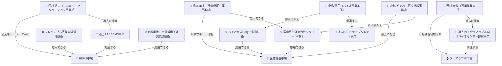

# 社内知識グラフの構造

---

## ワンメッセージ

**「誰が・何を・どの市場に活かせるか」を事前に地図として整備することで、テーマ入力時に関係者と関連資産を自動で辿れる。**

---

## グラフ全体図



---

## ノードの種類と意味

| 種類 | 記号 | 意味 |
|---|---|---|
| 市場 | 🏢🏥⌚ | 参入を検討する事業領域 |
| 技術 | ⚙️ | 自社が保有する技術・コア資産 |
| 過去PJ | 📁 | 過去に取り組んだ事業（失敗事例含む） |
| 人物 | 👤 | 担当可能な社内キーマン |

---

## エッジ（矢印）の種類と意味

| エッジのラベル | 意味 |
|---|---|
| 応用できる | その技術をその市場に転用できる |
| 担当できる | その人物がその技術を扱える |
| 過去に担当 | その人物・PJがその領域に関わった実績がある |
| 営業ネットワークあり | その人物がその市場に顧客・パートナーのつながりを持つ |
| 薬事サポート可能 | その人物が薬事認証の取得を支援できる |
| 市場調査経験あり | その人物がその市場を調査した経験がある |
| 関連する | 過去PJがその市場・技術に関係している |

---

## システムでの使われ方

ユーザーが「ビルエネルギー管理で新事業を考えたい」と入力した場合の例：

```
① 意味検索で「BEMS市場・薄膜太陽電池技術・BEMS過去PJ」がヒット
                    ↓
② そのヒットノードを起点にグラフを1ステップ辿る
                    ↓
③ 自動で以下が浮かび上がる：

   ・田村 浩二（BEMS事業の担当経験あり・営業ネットワークあり）
   ・フレキシブル薄膜太陽電池技術（応用できる）
   ・燃料電池・水電解用イオン交換膜技術（応用できる）
```

キーワード検索では「田村」という名前はヒットしない。
グラフを辿ることで、**意味検索だけでは見つからない関係者・資産を補完できる。**

---

## 補足：このグラフは静的・手動設計

現時点のグラフは社内の知識を手動で整理したものです。
ノードとエッジの追加・更新は担当者が行います（自動更新はMVP対象外）。
